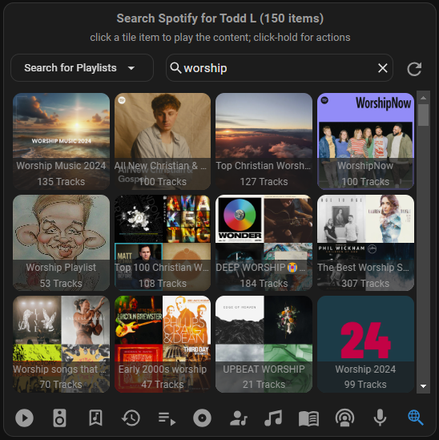
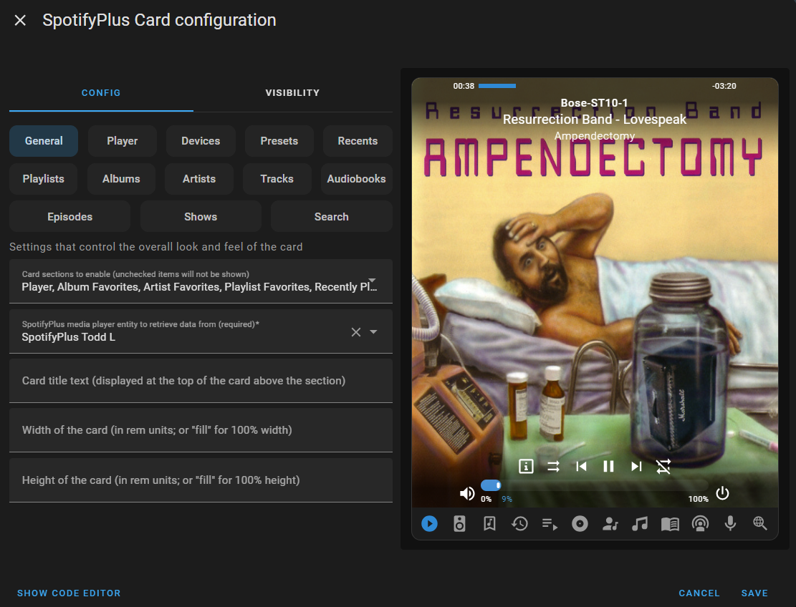

# SpotifyPlus Card

[![GitHub Release][releases-shield]][releases] [![License][license-shield]](LICENSE) [![docs][docs-shield]][docs] [![hacs][hacs-shield]][hacs]

![Project Maintenance][maintenance-shield] [![BuyMeCoffee][buymecoffee-shield]][buymecoffee]

_Home Assistant UI card that supports features unique to the [SpotifyPlus](https://github.com/thlucas1/homeassistantcomponent_spotifyplus) custom integration._  
Extended support for the SpotifyPlus product for use in Home Assistant.

## Features

* Spotify Media player interface with customizable controls and information display.
* Spotify real-time search for all media types.
* Display / Select your Spotify favorites: Albums, Artists, Audiobooks, Episodes, Shows, Tracks.
* Display / Select Spotify Connect device outputs.
* User-defined media item presets (both file and code edited supported).
* Favorite status / add / remove support for all media types.
* Card Configuration Editor User-Interface for changing options.

and more!

## How it Looks

Here's a quick overview on what the card can look like.  The card is highly customizable when it comes to the information displayed.  Check out the [UI Dashboards wiki](https://github.com/thlucas1/spotifyplus_card/wiki/UI-Dashboards) page for more examples and YAML configuration.

#### Media Player Control (Masonry Mode)  
 
 

#### Editor UI, General Options  
 

## HACS Installation Instructions (recommended)

- On your Home Assistant sidebar menu, go to HACS > Frontend
- Click on the 3-dot overflow menu in the upper right, and select `custom repositories` item.
- Copy / paste `https://github.com/thlucas1/spotifyplus_card` in the Repository textbox and select `Lovelace` for the category entry.
- Click on `Add` to add the custom repository.
- You can then click on the `SpotifyPlus Card` repository entry (you may need to filter your list first to find the new entry).
- Click on `download` to start the download. It will install the card to your `/config/www/community/ha_spotifyplus_card` directory.
- Go back on your dashboard and click on the icon at the right top corner then on Edit dashboard.
- You can now click on Add card in the bottom right corner and search for "Custom: SpotifyPlus Card".

## Manual Installation

- using the tool of choice open the directory (folder) for your HA configuration (where you find `configuration.yaml`).
- change directory to the `www` folder; if you don't have this directory, then create it.
- download the `spotifyplus-card.js` file from the [GitHub repository](https://github.com/thlucas1/spotifyplus_card) into your `<config>/www` folder.
- on your dashboard click on the icon at the right top corner then on Edit dashboard.
- click again on that icon and then on Manage resources.
- click on Add resource.
- copy and paste this: `/local/spotifyplus-card.js?v=1`.
- click on JavaScript Module then Create.
- go back and refresh your page.
- you can now click on Add card in the bottom right corner and search for "Custom: SpotifyPlus Card".
- after any update of the file you will have to edit `/local/spotifyplus-card.js?v=1` and change the version (e.g. `v=1`) to any higher number (e.g. `v=1.2`).

## More Information

Check out the following links for more information:

- [Card Wiki Home](https://github.com/thlucas1/spotifyplus_card/wiki)
- [Card Features](https://github.com/thlucas1/spotifyplus_card/wiki/Card-Features)
- [Card Configuration](https://github.com/thlucas1/spotifyplus_card/wiki/Configuration-Options)
- [Card UI Examples](https://github.com/thlucas1/spotifyplus_card/wiki/UI-Dashboards)
- [SpotifyPlus Integration](https://github.com/thlucas1/homeassistantcomponent_spotifyplus)

## Reporting a Problem

Submit a [Bug Report](https://github.com/thlucas1/spotifyplus_card/issues/new?assignees=&labels=Bug&projects=&template=bug.yml) to bring the issue to my attention. I receive a notification when a new issue is opened, and will do my best to address it in a prompt and professional manner.

## Request a New Feature

Do you have an idea for a new feature that could be added to the integration?  Submit a [Feature Request](https://github.com/thlucas1/spotifyplus_card/issues/new?assignees=&labels=Feature%2BRequest&projects=&template=feature_request.yml) to get your idea into the queue. I receive a notification when a new request is opened, and will do my best to turn your idea into the latest and greatest feature.

***

[releases-shield]: https://img.shields.io/github/release/thlucas1/spotifyplus_card.svg?style=for-the-badge
[releases]: https://github.com/thlucas1/spotifyplus_card/releases
[license-shield]: https://img.shields.io/github/license/thlucas1/spotifyplus_card.svg?style=for-the-badge
[docs]: https://github.com/thlucas1/spotifyplus_card/wiki
[docs-shield]: https://img.shields.io/badge/Docs-Wiki-blue.svg?style=for-the-badge
[hacs]: https://github.com/hacs/integration
[hacs-shield]: https://img.shields.io/badge/HACS-Default-41BDF5.svg?style=for-the-badge

[maintenance-shield]: https://img.shields.io/badge/maintainer-Todd%20Lucas%20%40thlucas1-blue.svg?style=for-the-badge
[buymecoffee]: https://www.buymeacoffee.com/thlucas1
[buymecoffee-shield]: https://img.shields.io/badge/buy%20me%20a%20coffee-donate-yellow.svg?style=for-the-badge
